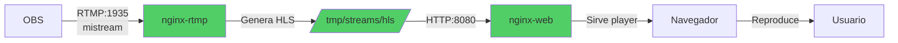

# 🚀 Despliegue Simple - StreamMaster Pro

## 📋 Resumen de Cambios

El sistema ha sido **simplificado** para streaming único:

- ✅ Sin backend API (Python/Flask)
- ✅ Sin Redis
- ✅ Sin sistema de tokens
- ✅ Configuración permanente
- ✅ Solo 2 contenedores: nginx-rtmp + web

---

## 🎯 Configuración Permanente

### OBS (Encoders)
```
Servidor: rtmp://72.62.86.94:1935/live
Clave: mistream
```

### Ver Streaming
```
http://72.62.86.94/
```

---

## 📦 Pasos de Despliegue

### 1. Conectar al VPS

```bash
ssh root@72.62.86.94
cd /docker/streammaster-pro
```

### 2. Actualizar código

```bash
git pull origin main
```

### 3. Detener servicios anteriores

```bash
docker-compose -f docker-compose.hostinger.yml down -v
```

**Nota:** El flag `-v` elimina los volúmenes de Redis (ya no necesarios).

### 4. Limpiar contenedores antiguos (opcional pero recomendado)

```bash
docker container prune -f
docker image prune -a -f
```

### 5. Construir e iniciar

```bash
docker-compose -f docker-compose.hostinger.yml up -d --build
```

### 6. Verificar estado

```bash
docker-compose -f docker-compose.hostinger.yml ps
```

**Esperado:**
```
NAME                    STATUS
streammaster-rtmp       Up
streammaster-web        Up
```

**Solo 2 contenedores** (antes eran 4).

### 7. Ver logs

```bash
# Logs de nginx-rtmp
docker logs streammaster-rtmp --tail=30

# Logs del web server
docker logs streammaster-web --tail=20
```

---

## 🔍 Verificaciones

### 1. Verificar nginx.conf

```bash
docker exec streammaster-rtmp cat /etc/nginx/nginx.conf | grep "hls_path"
```

**Esperado:**
```
hls_path /tmp/streams/hls;
```

### 2. Verificar puertos

```bash
# Puerto RTMP (1935)
netstat -tulpn | grep 1935

# Puerto HLS (8080)
netstat -tulpn | grep 8080

# Puerto Web (80)
netstat -tulpn | grep :80
```

Todos deben mostrar status "LISTEN".

### 3. Acceder al player

Abre en el navegador:
```
http://72.62.86.94/
```

Deberías ver la pantalla del player (aunque sin video hasta que OBS transmita).

---

## 🎬 Probar Streaming

### 1. Configurar OBS

Ver: [CONFIGURACION_OBS_SIMPLE.md](CONFIGURACION_OBS_SIMPLE.md)

Resumen rápido:
- Servidor: `rtmp://72.62.86.94:1935/live`
- Clave: `mistream`

### 2. Iniciar streaming en OBS

Click en **Iniciar transmisión**.

### 3. Verificar archivos HLS se crean

Espera 10-15 segundos, luego:

```bash
docker exec streammaster-rtmp ls -la /tmp/streams/hls/
```

**Deberías ver:**
```
-rw-r--r-- 1 nginx nginx  234 ... mistream.m3u8
-rw-r--r-- 1 nginx nginx  234567 ... mistream-0.ts
-rw-r--r-- 1 nginx nginx  234567 ... mistream-1.ts
```

### 4. Ver el stream en el navegador

Abre: `http://72.62.86.94/`

**El video debería aparecer automáticamente** después de 5-10 segundos.

---

## 📊 Arquitectura Final



---

## 🔧 Comandos Útiles

### Ver logs en tiempo real

```bash
docker logs streammaster-rtmp -f
```

Mientras OBS transmite, deberías ver:
```
[info] ... create: client publishing 'mistream' ...
```

### Reiniciar solo nginx-rtmp

```bash
docker-compose -f docker-compose.hostinger.yml restart rtmp-server
```

### Reiniciar todo

```bash
docker-compose -f docker-compose.hostinger.yml restart
```

### Ver estadísticas RTMP

Abre en navegador:
```
http://72.62.86.94:8080/stat
```

---

## ⚙️ Configuración Avanzada (Opcional)

### Proteger stream por IP

Editar `nginx/nginx.conf`:

```nginx
application live {
    # Solo permitir desde tu IP
    allow publish 123.45.67.89;
    deny publish all;
    
    # Cualquiera puede ver
    allow play all;
    
    # ... resto de configuración
}
```

### Grabar streams automáticamente

Editar `nginx/nginx.conf`:

```nginx
application live {
    live on;
    record all;
    record_path /tmp/streams/recordings;
    record_suffix -%Y-%m-%d-%H_%M_%S.flv;
    
    # ... resto de configuración
}
```

Crear directorio:
```bash
docker exec streammaster-rtmp mkdir -p /tmp/streams/recordings
```

---

## 🆘 Troubleshooting

### OBS no se conecta

```bash
# Ver firewall
sudo ufw status

# Abrir puerto si está cerrado
sudo ufw allow 1935/tcp
sudo ufw reload
```

### No se crean archivos HLS

```bash
# Ver permisos
docker exec streammaster-rtmp ls -la /tmp/streams/

# Corregir permisos si es necesario
docker exec streammaster-rtmp chmod -R 777 /tmp/streams
```

### Player no carga el video

1. Abrir consola del navegador (F12)
2. Buscar errores
3. Verificar que la URL HLS funciona directamente:
   ```
   http://72.62.86.94:8080/hls/mistream.m3u8
   ```

---

## 📝 Comparación Antes/Después

| Aspecto | Antes | Después |
|---------|-------|---------|
| Contenedores | 4 | 2 |
| Puertos | 1935, 80, 5000, 8080, 6379 | 1935, 80, 8080 |
| Configuración OBS | Generar token | Una vez |
| URL Player | Dinámica con token | Fija permanente |
| Mantenimiento | Backend + DB | Solo nginx |
| Complejidad | Alta | Baja |

---

## ✅ Checklist Post-Despliegue

- [ ] Solo 2 contenedores corriendo
- [ ] `docker logs streammaster-rtmp` sin errores
- [ ] Puerto 1935 abierto
- [ ] Puerto 8080 responde
- [ ] Puerto 80 responde
- [ ] OBS conecta exitosamente
- [ ] Archivos HLS se generan en `/tmp/streams/hls/`
- [ ] Player carga en `http://72.62.86.94/`
- [ ] Video se reproduce correctamente

---

## 🎉 Resultado Final

Sistema simplificado y funcionando:

1. ✅ Configuras OBS **una sola vez**
2. ✅ URL permanente: `http://72.62.86.94/`
3. ✅ Sin tokens, sin API, sin complicaciones
4. ✅ Solo inicias OBS y transmites

**¡Streaming simple y confiable!**
